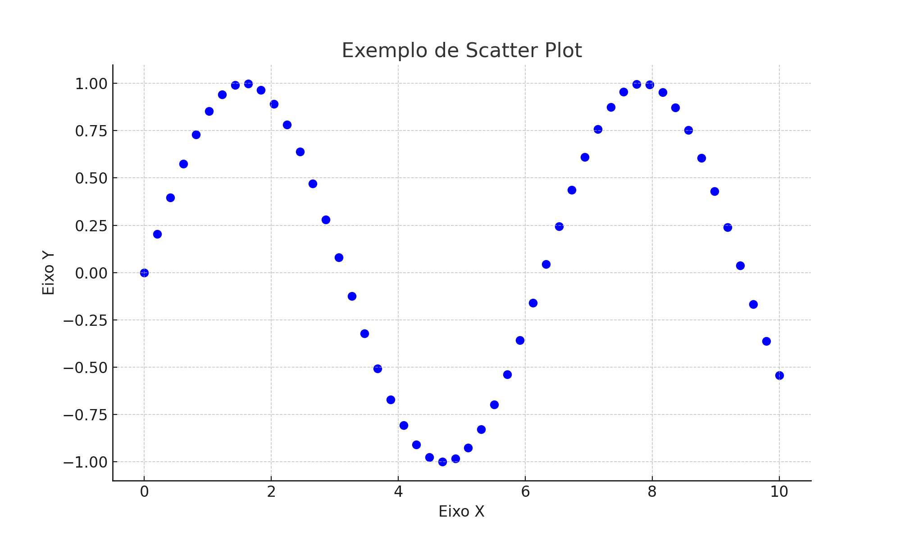
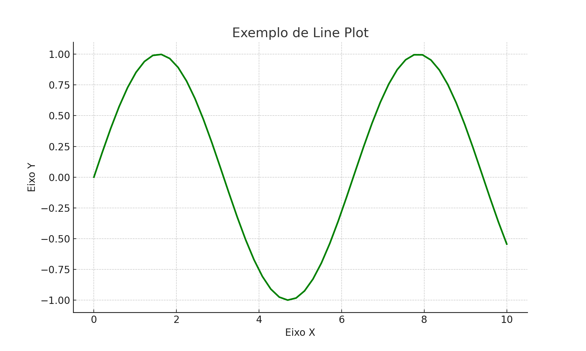
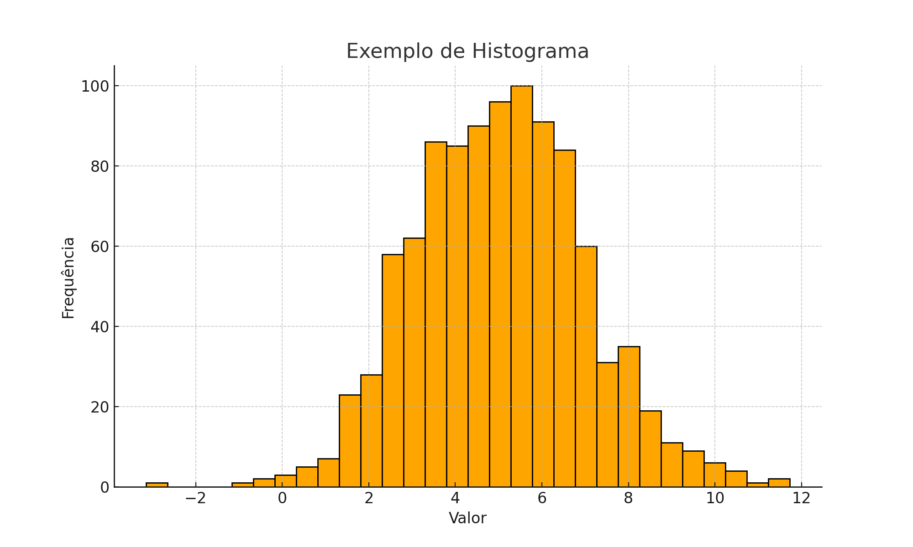

# Gráficos

## Como Criar Gráficos com Matplotlib

Esta seção irá te ensinar, de forma prática, a criar e personalizar gráficos usando a biblioteca `matplotlib.pyplot`, amplamente utilizada em Python para visualizações de dados.

***

### Como montar um gráfico

Para começar, importe a biblioteca `matplotlib.pyplot` (geralmente como `plt`) e crie seus dados. Também usaremos `numpy` para gerar dados numéricos com facilidade:

```python
import matplotlib.pyplot as plt
import numpy as np

x = np.linspace(0, 10, 100)  # Gera 100 valores entre 0 e 10
y = np.sin(x)  # Função seno aplicada aos valores de x
```

Para exibir o gráfico, basta usar a função `plot()` (ou `scatter()`, `hist()` etc. dependendo do tipo) e `show()`:

```python
plt.plot(x, y)  # Gráfico de linha
plt.show()
```

A função `plt.show()` é responsável por exibir a janela com o gráfico. Ela deve sempre ser chamada ao final da construção do gráfico.

***

### Edição dos Eixos

Você pode personalizar os eixos adicionando rótulos e títulos para tornar o gráfico mais claro:

```python
plt.xlabel("Eixo X")
plt.ylabel("Eixo Y")
plt.title("Gráfico da função seno")
```

Além disso, você pode definir os limites de visualização dos eixos com `xlim()` e `ylim()`:

```python
plt.xlim(0, 10)     # Limites do eixo X
plt.ylim(-1.5, 1.5) # Limites do eixo Y
```

Essas funções são úteis para dar zoom em partes específicas do gráfico ou padronizar a visualização.

***

### Cores, Tamanhos e Estilos

A função `plot()` do matplotlib permite customizar totalmente o estilo da linha ou dos pontos no gráfico.

Você pode modificar:

* **Cor da linha ou ponto**: `color='red'`, `color='blue'`, `color='#FF5733'` (hexadecimal)
* **Estilo da linha**:
  * `'solid'` ou `'-'` → linha contínua (padrão)
  * `'dashed'` ou `'--'` → linha tracejada
  * `'dotted'` ou `':'` → linha pontilhada
  * `'dashdot'` ou `'-.'` → linha traço-ponto
* **Marcadores (símbolos nos pontos)**:
  * `'o'` → círculo
  * `'s'` → quadrado
  * `'^'` → triângulo para cima
  * `'x'` → x
  * `'D'` → losango
* **Espessura da linha**: controlada por `linewidth` (ex: `linewidth=2` para mais grosso)

Exemplo completo:

```python
plt.plot(x, y, color='green', linestyle='--', linewidth=2, marker='o')
```

***

### Legendas

Legendas ajudam a identificar cada curva no gráfico, especialmente quando você plota várias linhas. Para adicionar uma legenda:

1. Use `label='nome'` em cada chamada de `plot()`
2. Depois, chame `plt.legend()` para exibi-la

```python
plt.plot(x, y, label='Seno')
plt.legend()
```

Por padrão, a legenda aparece no "melhor local" (`best`), mas você pode especificar a posição com o argumento `loc`, como:

* `'upper right'`
* `'upper left'`
* `'lower right'`
* `'lower left'`
* `'center'`
* `'center left'`, `'center right'`
* `'best'` (automático)

```python
plt.plot(x, y, label='Seno')
plt.legend(loc='upper right')
```

***

### Exemplos Práticos

Abaixo estão três tipos comuns de gráfico usando `matplotlib` e a sua visualização.

***

#### 1. Scatter Plot

```python
import matplotlib.pyplot as plt
import numpy as np

x = np.linspace(0, 10, 50)
y = np.sin(x)

plt.scatter(x, y, color='blue', marker='o')
plt.title('Exemplo de Scatter Plot')
plt.xlabel('Eixo X')
plt.ylabel('Eixo Y')
plt.grid(True)
plt.show()
```

<figure><figcaption><p>Figura 1. Exemplo de Scatter Plot</p></figcaption></figure>

***

#### 2. Line Plot

```python
import matplotlib.pyplot as plt
import numpy as np

x = np.linspace(0, 10, 50)
y = np.sin(x)

plt.plot(x, y, color='green', linestyle='-', linewidth=2)
plt.title('Exemplo de Line Plot')
plt.xlabel('Eixo X')
plt.ylabel('Eixo Y')
plt.grid(True)
plt.show()
```

<figure><figcaption><p>Figura 2. Exemplo de Line Plot</p></figcaption></figure>

***

#### 3. Histograma

```python
import matplotlib.pyplot as plt
import numpy as np

data = np.random.normal(loc=5.0, scale=2.0, size=1000)

plt.hist(data, bins=30, color='orange', edgecolor='black')
plt.title('Exemplo de Histograma')
plt.xlabel('Valor')
plt.ylabel('Frequência')
plt.grid(True)
plt.show()
```

<figure><figcaption><p>Figura 3. Exemplo de Histograma</p></figcaption></figure>

***

### Links Úteis

* [documentação oficial do Matplotlib](https://matplotlib.org/stable/contents.html).

```
```
